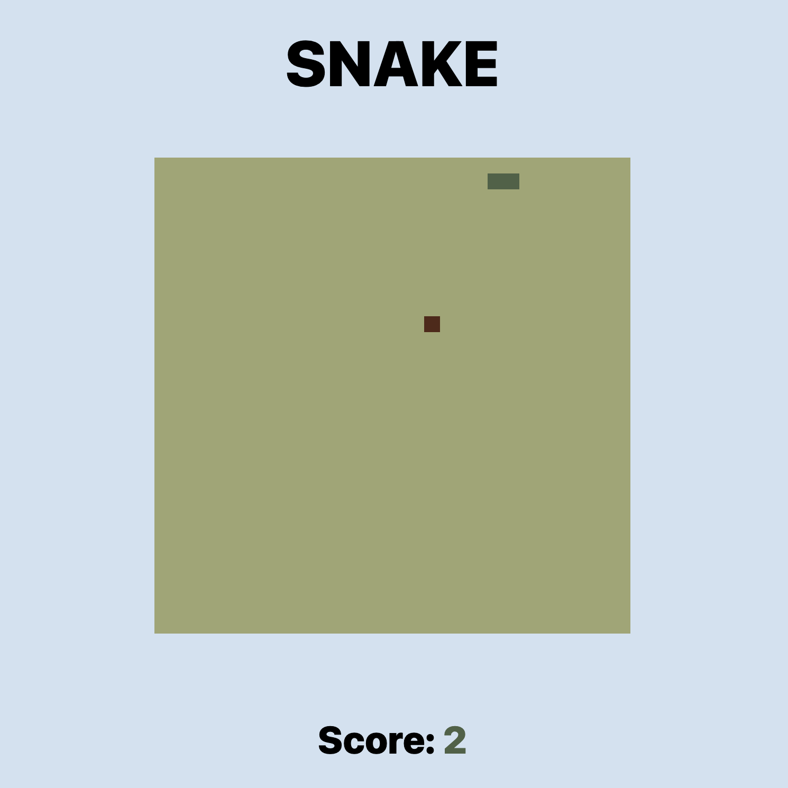

# Study project: Snake Game
The Snake Game project is a classic implementation of the popular Snake game using React as the frontend framework and Tailwind CSS for styling. The game involves controlling a snake that moves around a grid, eating food to grow longer, while avoiding collisions with itself and the bombs.

With each piece of food consumed, the speed increases, and a new bomb is randomly placed on the board.
You can find a legend in the top-right corner. Below it, you'll also see your top scores.

Have fun!

## Installation
1. Clone the repository `git clone https://github.com/GabrielaGodek/snake`
2. Change directory `cd snake`
3. Install dependencies `npm install`
4. At the terminal run the command `npm run start`
5. It will open localhost at http://127.0.0.1:3000/

Or enjoy the game right away: `https://snake-g0gab1s.vercel.app/`

### Structure
- `src/`: Contains the source code of the React application.
  - `components/`: React components used in the project.
  - `styles/`: Stylesheets, including Tailwind CSS files.
  - `index.js`: The main application component.
- `public/`: Public assets and the HTML template.

## Dependencies
- react: `^18.2.0` 
- react-dom: `^18.2.0`
- tailwindcss: `^3.3.6` 

## Preview
Live demo: https://snake-g0gab1s.vercel.app/

### Authors
Gabriela Godek
